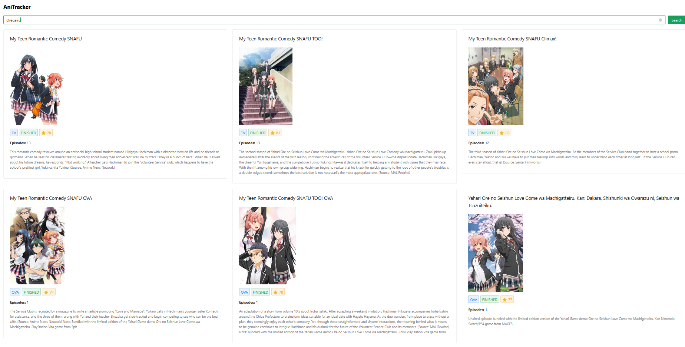

# AniTracker

AniTracker is a Vue-based anime tracking app powered by the AniList API.

## Features

- Search for anime titles
- View anime details

## Future Plans

- Add user authentication and profiles
- Implement personal anime lists and favorites
- Enable anime episode tracking and progress
- Add ratings and reviews for anime
- Improve UI/UX with more themes and responsive design
- Integrate notifications for new episodes or releases
- Support manga tracking alongside anime
- Add social features (friends, sharing lists)


### Search Results



## Getting Started

1. Install dependencies:
   ```
   npm install
   ```
2. Start the development server:
   ```
   npm run dev
   ```

## License

MIT